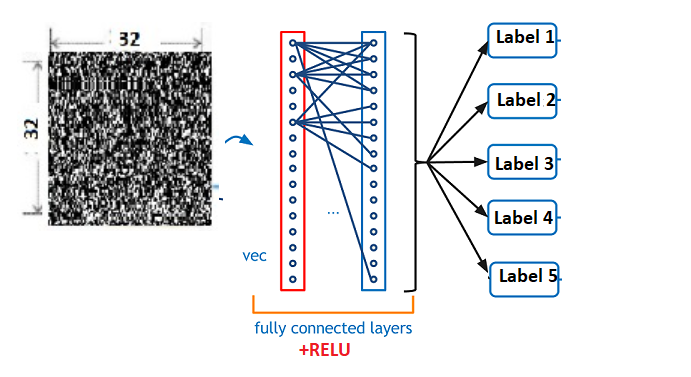
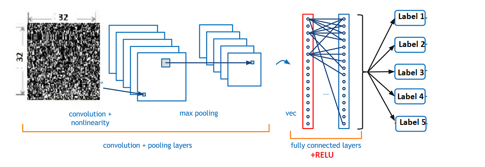
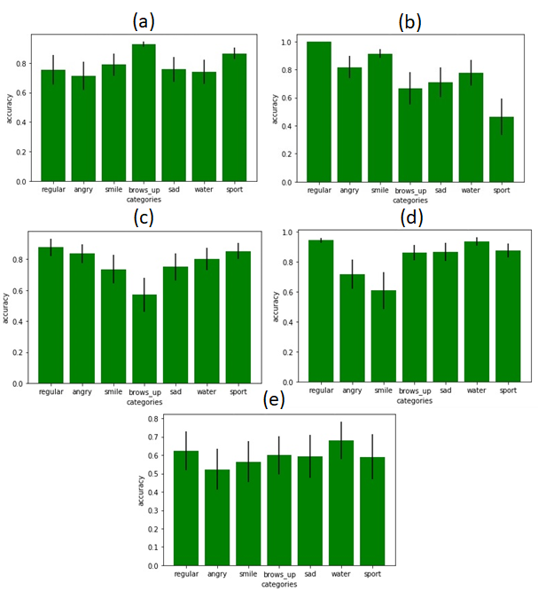
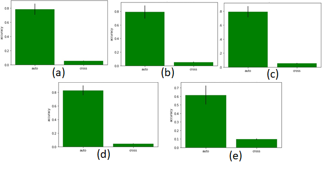

# Speckles-classification
Python implementation of our paper: [Photonic Human Identification based on Deep Learning of Back Scattered Laser Speckle Patterns](https://github.com/zeevikal/speckles-classification).

This project is our final project in [CS231n-TLV (MDLI)](https://machinelearning.co.il/3653/dlcourse-final-2/) Course.
We would like to thank Professor Zeev Zalevsky for his guidance, support and help throughout the process! 
### Abstract
The analysis of the dynamics of speckle patterns that are generated when laser light is back scattered from a tissue has been recently shown as very applicable for remote sensing of various bio-medical parameters. In this work we present how analysis of a static single speckle pattern scattered from the forehead of a subject, together with advanced machine learning techniques based on multilayered neural networks, can offer novel approach to accurate identification within a small predefined number of classes (e.g. a ‘smart home’ setting which restricts its operations for family members only). Processing the static scattering speckle pattern by neural networks enables extraction of unique features with no previous expert knowledge being required. Using the right model allows for a very accurate differentiation between classes and it can form a basis for using speckles patterns as a form of identity measure of ‘forehead-print’.

### Models Architecture
##### DNN architecture

##### CNN architecture


### Results (on our data)
##### Accuracy rates of classifying correctly each class within every physical subset of it

##### Accuracy rates of classifying correctly each class as opposed to false negative classification rate


### Training on your own data
1. Create python 3 environment (with virtuelenv / conda) 
2. Install project requirements: `pip install -r requirements.txt`
3. Drag your video data to `data/frames`
4. Extract frames from videos using `data_prep_utils.py` function, according to your data structure.
5. Create your own `training_params.json`, with all needed parameters. for example:
```json
{
	"train": {
		"model_path_prefix": "your_model_path_prefix",
		"model_path": "models",
		"dates": ["24032019", "17042019", "01052019"],
		"labels": ["label1", "label2", "label3", "label4", "label5"],
		"pre_trained_model_path": "path/to/pre_trained_model.h5",
		"data_path": "data/frames",
		"model_weights": "None",
		"is_dnn": "True",
		"is_dim_3d": "False",
		"frames_size": 32,
		"valid_and_test": 0.2,
		"valid_precent_split": 0.5,
		"conf_list": [
			[32, 300, 100, 0.2],
			[32, 300, 100, 0.4],
			[32, 512, 256, 0.4],
			[32, 512, 256, 0.2],
			[32, 256, 128, 0.4],
			[32, 256, 128, 0.2]
		],
		"n_epochs": 10,
		"n_batch_size": 256
	},
	"test": {
		"pre_trained_model_path": "path/to/pre_trained_model.h5",
		"dates": ["24032019", "17042019", "01052019"],
		"labels": ["label1", "label2", "label3", "label4", "label5"],
		"data_path": "data/frames",
		"categorized_frames_path": "data/categorized_frames",
		"is_cnn": "False",
		"to_plot": "True",
		"frame_size": 32
	}
}
```
6. Run training process in `run.py`. for example:
```
python run.py -m train -j training_params.json
```
* `-m` is the process mode (training or testing)
* `-j` is the json file path
7. for test your model run:
```
python run.py -m test -j training_params.json
```

### License
This project is licensed under the terms of the [MIT license](https://github.com/zeevikal/speckles-classification/blob/master/LICENSE).